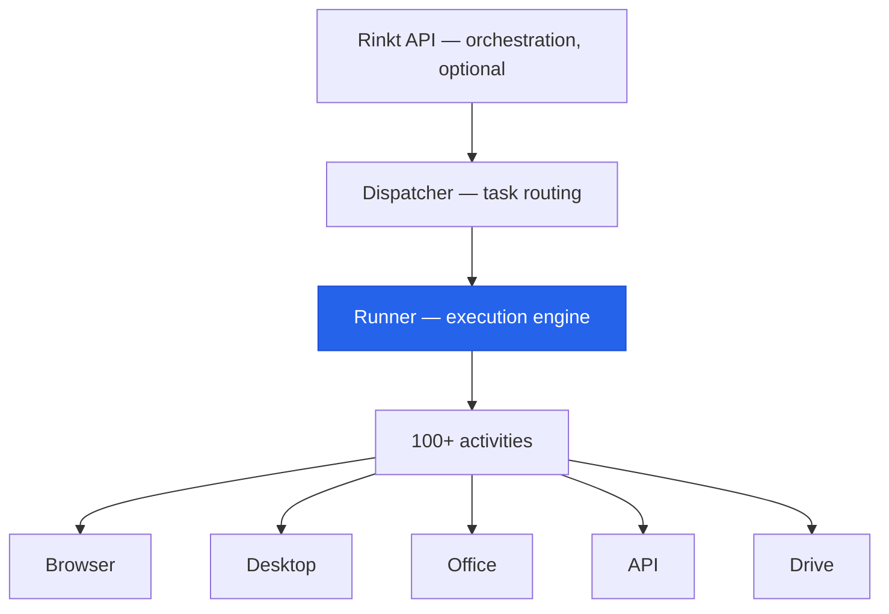

<p align="center">
  
</p>

**One binary. Browser, desktop, Office, and API automation with durable execution.**

Rinkt Runner is a cross-platform automation engine built in Go. It executes
workflows that span Playwright-driven browsers, native desktop applications,
Microsoft Office, REST/GraphQL APIs, and Google Drive — from a single
lightweight process. No orchestration server required for standalone use.

<!-- TODO: Add product screenshot once assets/demo.png is captured
<p align="center">
  
</p>
-->

---

## Why Rinkt Runner?

Most automation tools force you to choose: **browser OR desktop OR API**.
Runner handles all three in one workflow.

| | Rinkt Runner | Zapier / Make | n8n | UiPath |
|---|:---:|:---:|:---:|:---:|
| Browser automation (Playwright) | Yes | No | Plugin | Yes |
| Desktop app control | Yes | No | No | Yes |
| Office automation (Excel, Word, Outlook) | Yes | No | No | Yes |
| REST / GraphQL APIs | Yes | Yes | Yes | Yes |
| Single binary, no installer | Yes | N/A (SaaS) | Docker | No |
| Code-first workflow definitions | Yes | No | Partial | No |
| CAPTCHA solving | Built-in | No | No | Plugin |
| Pre-built integrations | 100+ | 6,000+ | 1,000+ | 500+ |
| No-code visual builder | No | Yes | Yes | Yes |
| Deploy as system service | Yes | N/A | Docker | Yes |
| Runs without cloud account | Yes | No | Yes | Yes |

## How it works



Runner can operate standalone or as part of the full Rinkt platform. In
standalone mode, it picks up workflow definitions from local files. In platform
mode, it receives tasks from the Dispatcher and reports results back.

## What can it automate?

**100+ built-in activity types** across these domains:

- **Browser** — Navigate, click, fill forms, scrape data, take screenshots,
  handle authentication flows. Powered by Playwright (Chromium, Firefox, WebKit).
- **Desktop** — Control native Windows and macOS applications. Click, type,
  read screen content, interact with UI elements.
- **Office** — Read and write Excel workbooks, generate Word documents, send
  Outlook emails, manipulate file formats.
- **API** — Call REST and GraphQL endpoints, handle authentication, parse
  responses, chain requests.
- **Google Drive** — Upload, download, organise files and folders.
- **CAPTCHA** — Solve CAPTCHAs inline during browser automation.
- **System** — File operations, process management, environment detection.

## Example workflow

```yaml
# Scrape invoice data from a web portal, write to Excel, email the report
name: weekly-invoice-report
steps:
  - browser.navigate:
      url: https://vendor-portal.example.com/invoices
  - browser.login:
      credentials: vault://vendor-portal
  - browser.scrape:
      selector: table.invoices
      output: invoice_data
  - office.excel.write:
      file: reports/invoices-{{date}}.xlsx
      data: "{{invoice_data}}"
  - office.outlook.send:
      to: finance@company.com
      subject: "Weekly invoice report - {{date}}"
      attachments:
        - reports/invoices-{{date}}.xlsx
```

*Schema is beta and may evolve. The workflow model — define steps declaratively, Runner handles execution — is stable.*

## Technical details

- **Language:** Go
- **UI framework:** Wails 3 (optional desktop GUI)
- **Browser engine:** Playwright (bundled)
- **Deployment:** Single binary, system service, or Docker container
- **Platforms:** Windows (amd64), macOS (amd64, arm64), Linux (amd64)
- **Observability:** Built-in metrics and structured logging
- **Updates:** Automatic self-update mechanism

## Roadmap

| Milestone | Status |
|---|---|
| Plugin system for custom activities | Planned |
| GitHub Actions integration | Planned |
| VS Code extension | Planned |
| Workflow marketplace | Exploring |

## Get involved

- **[Watch this repo](https://github.com/RinktLtd/runner/subscription)** to get notified when source is published
- **[Request beta access](https://rinkt.com)** to try Runner now
- **[Discussions](https://github.com/RinktLtd/runner/discussions)** — Ask questions and share ideas
- **[Issues](https://github.com/RinktLtd/runner/issues)** — Report bugs or request features

## Related repositories

| Repo | Description |
|---|---|
| [dispatcher](https://github.com/RinktLtd/dispatcher) | Workflow task routing and scheduling |
| [python-interpreter](https://github.com/RinktLtd/python-interpreter) | Embedded Python runtime for workflow scripting |

## License

Source-available license. Details to be published.

---

Built by [Rinkt](https://github.com/RinktLtd).
